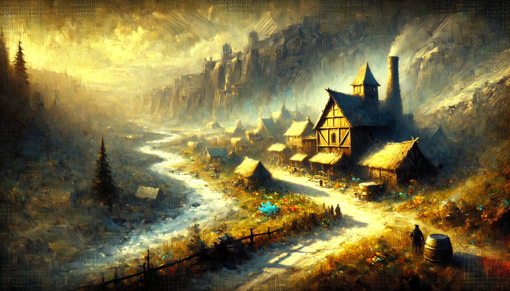
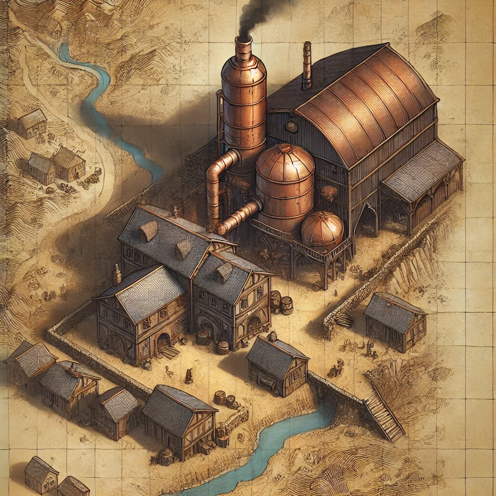

# Slitherskin Drinkery

### An Adventure for four to six 5th-level characters

## Background

In the forgotten town of **Slitherskin Hollow**, an ancient secret lurks just beneath the surface. The town’s fame rests solely on the reputation of its brewery, the **Slitherskin Drinkery**, where the thick and venom-laced **Slitherskin** brew is served to daring patrons. However, unknown to most, this brew’s unique flavor comes from a sinister source—a monstrous snake that resides beneath the drinkery, its shed skin used to make the infamous snake-skin mugs, and its venom harvested for the brew.

**Jimbo “Pops” Slitherskin**, a Duergar who runs the drinkery, keeps the beast captive in the forgotten catacombs beneath the tavern. Thanks to his natural resistance to poison and darkvision, Pops has managed to survive the snake’s toxic surroundings and keep the serpent under wraps for years. Over time, the snake has grown massive and developed a taste for flesh. Pops, desperate to keep his tavern and livelihood afloat, has turned to increasingly dark methods to maintain his business, but no one is truly sure of what happens to those who disappear in **Slitherskin Hollow**.

The adventurers find themselves in **Slitherskin Hollow**, drawn by rumors of missing travelers, a deadly drinking contest, or tales of a brew that few can survive. What lies beneath the drinkery, however, is a far darker truth, hidden under layers of secrecy and veiled smiles.

## Adventure Hooks

You can use one or more of the following hooks to bring the party into the events of **Slitherskin Hollow**:

1. **The Missing Merchant**: A wealthy merchant named **Lilyen Fordry** has lost contact with her brother, a traveling merchant last seen near **Slitherskin Hollow**. She hires the party to investigate his whereabouts, offering a substantial reward for news of his fate.

2. **The Slitherskin Challenge**: The adventurers hear tales from a local bard about a deadly drinking challenge at the **Slitherskin Drinkery**, where only the bravest drinkers attempt to survive the venom-laced brew. Flyers can be found nailed to trees or dropped along the road, and word of mouth travels fast about this infamous contest. Adventurers might even witness a traveler drop a flyer or see one nailed prominently to a tree as they pass by.

   > You notice a brightly colored flyer fluttering in the wind, nailed to a tree along the dusty road. “**Test Your Mettle! The Legendary Slitherskin Challenge Awaits at the Drinkery!**” it boasts in bold letters, followed by promises of glory, free drinks, and eternal renown for those who can finish the deadly brew.

3. **Bandits and Bodies**: A noble hires the party to investigate the strange disappearances of several travelers last seen near **Slitherskin Hollow**. While no evidence points directly to the tavern, the noble believes the key to solving the mystery lies somewhere within the town.

[TODO: IMAGE - TOP-DOWN MAP OF SLITHERSKIN HOLLOW]

## Setting the Adventure

The adventure takes place in **Slitherskin Hollow**, a small, run-down town built around its central attraction, the **Slitherskin Drinkery**. While the town’s inhabitants are few, it still sees a trickle of visitors thanks to the drinkery’s infamous brew and deadly challenge. The town’s economy depends entirely on the drinkery, making Pops both respected and feared by the locals.

**Slitherskin Hollow** lies along a dusty trade route, but over the years, it has become a place of mystery, with whispers of missing travelers and eerie happenings surrounding the drinkery.

## Locations in Slitherskin Hollow

### Slitherskin Hollow: General Features

- **Palisade**: A dilapidated wooden fence surrounds the village’s edge, providing a bare minimum of protection. Several sections are damaged or missing entirely, leaving gaps that anyone could easily walk through.

- **Dusty Path**: The road that cuts through **Slitherskin Hollow** is little more than a dirt path, well-trodden by travelers but poorly maintained. Footprints of those who have come before are visible in the hard-packed earth, mingled with the deep ruts left by wagons.

- **Buildings**: The structures in the town are mostly made of old, weather-beaten wood. Their shingled roofs sag, and many windows are cracked or missing, covered in layers of grime. A few stray lights flicker in the windows, casting long shadows onto the empty streets.

### 1. The Slitherskin Drinkery

The heart of **Slitherskin Hollow**, the **Slitherskin Drinkery**, is a two-story wooden building that serves as the town’s tavern and brewery. The scent of barley, wood smoke, and something faintly sour lingers in the air, blending into a distinctive aroma.

> The dry wind carries dust as you approach the **Slitherskin Drinkery**, the largest building in town. Its windows are smeared with grime, but from inside, the sound of laughter, clinking mugs, and the strumming of a lute spills out. A weathered sign above the door, made of worn wood and shaped like a snake, sways in the breeze. Flyers boasting the **Slitherskin Challenge** are nailed haphazardly to the outside walls, crowding the space and giving the tavern an almost desperate, carnival-like atmosphere.

#### Common Room

The first floor of the drinkery is the **common room**, where patrons gather to drink, eat, and test their mettle in the **Slitherskin Challenge**.

> The common room of the **Slitherskin Drinkery** is a low-ceilinged, dimly lit space, with thick wooden beams running overhead. The scent of strong ale, sweat, and old wood mingles in the air. A roaring fire crackles in the hearth, casting flickering light over the motley crowd of patrons gathered around battered wooden tables. The walls are plastered with drawings of past **Challenge Champions**, each carefully sketched by Pops himself. Some patrons gather around a large, snake-shaped keg adorned with signs reading, “**Are You Brave Enough? Take the Slitherskin Challenge!**”

##### The Slitherskin Challenge

The **Slitherskin Challenge** is the tavern’s main attraction. It consists of drinking several pints of the **Slitherskin Brew**, each progressively more venom-laced than the last. The cost to enter the challenge is 1 gp, a low enough price to lure in travelers. However, once the challenge begins, participants cannot stop until they either win or pass out.

> A crowd begins to form as a brave soul steps up to the bar, coins jingling as they accept the **Slitherskin Challenge**. Patrons pound their mugs on the wooden tables, chanting, “**Gulp! Gulp! Gulp!**” as the first pint is poured. Each sip is met with cheers, jeers, and the occasional groan from those who have already failed.

1. **First Pint**: A deep, thick brew that leaves a strange, tingling sensation on the tongue.
   - **Effect**: DC 10 Constitution saving throw. On a failure, the character becomes tipsy. No further consequences at this point.
   - **Boxed Text**:
     > The first pint goes down relatively easy, the venom leaving just a mild tingle on your lips. The crowd is rowdy, slamming their mugs and hollering in encouragement as you raise your glass.

2. **Second Pint**: The tingling spreads to the throat and stomach, accompanied by an intense warmth.
   - **Effect**: DC 13 Constitution saving throw. On a failure, the character suffers 1d4 poison damage and becomes poisoned for 10 minutes.
   - **Boxed Text**:
     > The second pint is heavier, and the heat starts to build in your chest. The tingling has moved to your throat, and the crowd roars louder, sensing that the challenge is just beginning.

3. **Third Pint**: The brew now begins to taste acrid and burns the throat as it goes down.
   - **Effect**: DC 15 Constitution saving throw. On a failure, the character suffers 2d6 poison damage and becomes poisoned for 1 hour.
   - **Boxed Text**:
     > The third pint burns as it slides down your throat. Sweat beads on your brow, and the cheers of the crowd are now mixed with groans of sympathy from those who couldn’t make it this far.

4. **Fourth Pint**: The venom is thick in the liquid, numbing the lips and sending shocks of pain through the body.
   - **Effect**: DC 18 Constitution saving throw. On a failure, the character takes 3d8 poison damage and becomes poisoned for 1 hour. If poisoned, the character has disadvantage on all attacks and saving throws during this time.
   - **Boxed Text**:
     > Your lips go numb as you raise the fourth pint. Each gulp sends a jolt of pain through your body, but the crowd is relentless, chanting your name as they pound their mugs against the tables.

5. **Fifth Pint**: The final challenge, only for the most daring (or foolish) of adventurers.
   - **Effect**: DC 20 Constitution saving throw. On a failure, the character takes 4d10 poison damage and must make a DC 15 death saving throw. If successful, the character completes the challenge. If they fail, they pass out.
   - **Boxed Text**:
     > The fifth pint is a nightmare, every drop like fire in your veins. The crowd is on its feet now, stomping, chanting, and urging you on with feverish excitement. You’re on the verge of victory or defeat.

##### Winning the Challenge

If the adventurer succeeds in drinking all five pints, the crowd erupts into wild cheers. Pops claps them on the back, proud to add another champion to the walls of the tavern.

> "Well done!" Pops booms, grabbing a piece of parchment and furiously sketching the adventurer's face. "I'll get this up on the wall with the rest of the champions, and the next round's on me! And everyone else gets a round too!" The room fills with laughter, cheers, and mugs raised in toast.

If the adventurer passes out, two figures in aprons quietly escort them from the room. Pops assures everyone that they’ll be fine by morning, but his words carry a subtle undertone that suggests otherwise.

#### Pops' Book

Unknown to patrons, Pops keeps a journal in his office, detailing the likenesses of everyone who participated in the **Slitherskin Challenge**. For those who vanish, their faces are sketched and marked with an ominous date.

#### Additional Content: Pops' Nightly Routine

Pops takes care to keep his dark secret hidden. However, astute adventurers may notice odd occurrences around the tavern during their stay. At night, Pops sneaks down into the basement, but few know why. Any strange noises are quickly explained away by Pops, who never lingers on the subject for long.

**Perception Checks**: During the night, adventurers may make a **DC 14 Perception check** to hear faint hissing noises from below the tavern or the soft creaking of floorboards as Pops descends to the basement. If successful, they hear the distant sound of something large stirring and Pops muttering quietly to himself.

> Late at night, the sound of soft footsteps and a creaking door disturbs the silence. A faint hiss follows, almost drowned out by the crackle of the dying fire. From the shadows, Pops can be seen slipping into the basement, a bundle slung over his shoulder.

**Investigation**: A **DC 15 Investigation check** reveals faint scratch marks near the basement door, as though something large and heavy has been dragged through recently. If confronted, Pops brushes off any suspicions, claiming it’s just the building settling.

> The air near the basement door carries an unfamiliar scent—faintly acrid and sharp. Scratch marks mar the floor, as if something heavy has been dragged across it multiple times. Pops offers no explanation, quickly changing the subject with a nervous chuckle.

#### Kitchen

The kitchen is where the tavern’s food is prepared, but it is also where some of the more curious activities may be noticed. The floor is marked with scratches, suggesting that something heavy has been moved frequently through the space.

> The kitchen is a hot, narrow room filled with the scent of roasting meat and simmering sauces. Copper pots hang from hooks, and a stout dwarf stands at the stove, stirring with mechanical precision. Every so often, a loud clatter of metal disrupts the otherwise steady rhythm of the kitchen.

- **Dalmir Bhardain** (Dwarf Chef)
  - **Appearance**: A stocky, middle-aged dwarf with a gruff demeanor. His apron is stained with grease, and his arms are thick from years of working the stove.
  - **Roleplaying Dalmir**: Dalmir is focused solely on cooking and avoids any involvement in the tavern’s other affairs. He brushes off any questions about strange noises or odd occurrences, claiming, “I just make the food. Don’t ask about the rest.”

#### Key NPCs in the Drinkery

- **Jimbo "Pops" Slitherskin** (Proprietor)
  - **Appearance**: Pops is a grizzled, gray-bearded duergar. His eyes have a faint red glow from his darkvision, and he speaks in a jovial tone that belies the tension beneath the surface.
  - **Roleplaying Pops**: Pops is charming and engaging, always ready with a friendly word and a push toward the **Slitherskin Challenge**. However, should adventurers pry too deeply into the basement or the snake, Pops grows increasingly evasive. A **DC 15 Insight check** reveals subtle signs of discomfort as the conversation lingers on these topics.

  > Pops constantly wipes down mugs and hums cheerfully as he works the room. "Come on, give the challenge a try! It could make ya famous!" His voice is lighthearted, but those paying close attention notice his eyes dart toward the basement door when no one's looking.

- **Rose** (Waitress)
  - **Appearance**: A young, upbeat halfling with dark curly hair and bright eyes. She always has a baby girl, Poppy, nearby.
  - **Roleplaying Rose**: Rose is cheerful and hardworking, but her loyalty to Pops is beginning to fray. She has noticed things around the tavern that make her uneasy, though she won’t voice these concerns unless pressed. A **DC 12 Persuasion check** can coax her into admitting that Pops has been acting strange recently, often disappearing into the basement at odd hours.

- **Fizwick Bramblebrew** (Patron)
  - **Appearance**: A lean, older gnome with bushy eyebrows and a wide grin. He frequents the tavern and is a known supporter of Pops.
  - **Roleplaying Fizwick**: Fizwick enjoys the atmosphere of the **Slitherskin Drinkery** and has attempted the **Slitherskin Challenge** multiple times, though he has yet to succeed. He is quick to share tales of his near victories and is often found persuading newcomers to take up the challenge themselves.

- **Quinn Rorhstead** (Bard/Traveling Musician)
  - **Appearance**: A middle-aged half-elf with long hair tied back and a slight smirk.
  - **Roleplaying Quinn**: Quinn claims to just be passing through, but he is quietly investigating the disappearance of a friend who was last seen in **Slitherskin Hollow**. If pressed, he admits to finding something odd near the tavern—an item belonging to his friend, but no sign of the man himself.

### 3. The Brewery

The brewery behind the tavern is where the **Slitherskin Brew** is made. The structure contains several large vats, barrels of aging ale, and supplies for brewing. Despite the lively atmosphere of the tavern, the brewery has an eerie stillness to it, a cold contrast to the rest of the building.

> The air in the brewery is thick with the smell of fermenting barley and yeast. Massive wooden vats line the walls, some adorned with the snake-shaped emblem of the **Slitherskin Drinkery**. A copper still bubbles quietly in the corner, filling the space with a low, constant hum.

#### Storage Room

Behind the brewery is a storage area filled with crates of mugs made from snake skin and barrels of **Slitherskin Brew**. However, one large shelf in the corner conceals a secret entrance to the catacombs below the tavern.

- **Secret Door**: A **DC 15 Investigation check** reveals that the shelf has been moved recently and that a hidden switch beneath the barrels activates the door.

> A layer of dust covers much of the storage room, but a corner of the floor looks recently disturbed. Crates of wooden mugs are stacked haphazardly, and the air is thick with the musty scent of barley and aged ale. A faint draft slips through the cracks, and upon closer inspection, you notice the shelf along the far wall shifts ever so slightly when pushed.

#### The Catacombs Beneath the Brewery

Beneath the **Slitherskin Drinkery** lies a series of forgotten catacombs, now home to the **Giant Slitherskin**. The tunnels are narrow and uneven, barely wide enough for the massive snake to move through, and the air is thick with the scent of decay.

> The tunnel grows colder as you descend into the catacombs. Narrow stone passages twist and turn, with damp, uneven walls that bear faint scratch marks. A distant hiss echoes through the dark, followed by an unsettling silence.

[TODO: IMAGE - MAP OF THE CATACOMBS]

##### The Lair of the Giant Slitherskin

The deepest chamber in the catacombs is where the **Giant Slitherskin** resides, coiled among the remnants of past meals. Its lair is filled with shed scales, bones, and the faint stench of death.

> The chamber opens up into a cold, damp space. The walls are lined with the shimmering, discarded skins of the monstrous snake, and its massive body coils tightly in the center, muscles rippling beneath its scales. Bones litter the ground, cracked and scattered, and the air is thick with the stench of rot. Cold, calculating eyes watch you from the shadows.

## Special Events

### 1. The Disappearing Patron

As the adventurers enjoy their evening in the **Slitherskin Drinkery**, a boisterous traveler decides to take on the infamous **Slitherskin Challenge**:

> The tavern's warm glow flickers as a burly traveler stands, cheered on by the crowd. He raises his first mug of **Slitherskin Brew** in triumph and downs it in one gulp. The second follows quickly, to more applause. But by the third, his hands begin to tremble. He grins weakly, raising the mug one last time before collapsing onto the table, unconscious.

If no character has a passive Wisdom (Perception) score of 13 or higher, they notice nothing unusual. Otherwise, read:

> As the traveler slumps forward, two sloppily dressed men in aprons approach him, lifting his limp body with practiced ease. “Don’t worry, friends, we’ll take him to his room,” Pops assures the crowd with a grin, though something about the way he says it seems off.

The adventurers can make a **DC 13 Insight check** to determine if Pops is being deceptive. If successful, they sense that something is wrong. Following the men will lead them to the basement, where the unconscious patron is being prepared to be fed to the **Giant Slitherskin**.

### 2. The Creeping Sounds

This event occurs late at night, as the adventurers explore the outskirts of **Slitherskin Hollow**:

> The wind howls, biting through your clothes as you traverse the edge of the village. Suddenly, a low rumble echoes from beneath the ground, followed by the faintest sound of scratching, like claws scraping against stone. For a moment, the wind stills, and the eerie sound of slithering reaches your ears from deep beneath the earth.

If no character has a passive Wisdom (Perception) score of 14 or higher, they cannot pinpoint the source of the sound. Otherwise, read:

> The noise seems to come from the direction of the drinkery, somewhere below it. The faint sound of scales scraping against stone becomes unmistakable, like something enormous moving underground.

The adventurers can follow the sounds to the drinkery’s basement. These sounds hint at the presence of the **Giant Slitherskin**, stirring in its underground lair.

### 3. The Abandoned Cart

This event occurs as the adventurers make their way into **Slitherskin Hollow**:

> The winding road leading to the village is flanked by thick trees. Just ahead, you spot a small cart overturned on the side of the road, its wheels half-buried in the dirt. Broken crates and supplies are scattered across the ground, along with deep drag marks leading into the forest.

If no character has a passive Wisdom (Perception) score of 12 or higher, the party notices only the overturned cart. Otherwise, read:

> Blood stains the dirt, and the tracks seem fresh. Following the trail reveals more signs of struggle—pieces of torn cloth, a discarded boot, and large snake-like scales lying in the underbrush.

A **DC 13 Survival check** allows the adventurers to follow the tracks into the forest, leading them to clues that a traveler was ambushed and dragged toward the catacombs beneath the drinkery to be fed to the **Giant Slitherskin**.

### 4. Pops’ Nightly Routine

Pops has a careful routine of feeding the **Giant Slitherskin** at night, taking great care to avoid suspicion. This event can be triggered if the adventurers stay at the **Slitherskin Drinkery** overnight:

> As the fire in the hearth dies down and the tavern falls silent, you hear the faint creak of floorboards. Pops, hunched and muttering to himself, carries a bundle slung over his shoulder as he disappears into the basement.

A **DC 14 Perception check** allows the adventurers to hear faint hissing from below the tavern or the creaking of the basement door. If they investigate further, they can attempt a **DC 15 Investigation check** to find scratch marks near the basement door, suggesting something large has been dragged repeatedly.

> The smell near the basement door is acrid, like something rotting just beneath the surface. Faint scratches line the floor, and Pops quickly changes the subject if questioned, laughing nervously.

### 5. Disturbances in the Night

Each night the adventurers stay in the **Slitherskin Drinkery**, there is a chance they will encounter strange disturbances:

> The tavern grows still, and in the quiet, you hear strange sounds—hissing, scratching, or even the distant echo of a scream that’s abruptly cut off.

The GM may roll a d6 to determine the event that occurs:

| **1d6 Roll** | **Event** |
|--------------|-----------|
| 1-2          | Faint hissing echoes from beneath the tavern. |
| 3-4          | Scratch marks appear on the adventurers’ windowsills, but nothing is in sight. |
| 5            | A scream pierces the night but is quickly silenced. |
| 6            | An unsettling quiet blankets the area—nothing stirs, not even the wind. |

### 6. The Roadside Sign

This event occurs as the adventurers make their way toward **Slitherskin Hollow**:

> A crooked wooden signpost stands at a crossroads, its paint chipped and worn from years of exposure to the elements. “Come One, Come All! **Slitherskin Drinkery** – Home of the Famous Slitherskin Brew!” The sign promises warm beds and a challenge that only the bravest travelers can face.

If the adventurers inspect the sign closely, they may notice a smaller piece of parchment pinned to the back:

> “Travelers Beware! Strange Disappearances Reported Near Slitherskin Hollow. Watch the Shadows.”

This sign is meant to lure adventurers toward **Slitherskin Hollow**, where the infamous drinkery and the dark secrets beneath it await.

## Treasure

The following magical treasures can be found throughout **Slitherskin Hollow**, hidden away in various parts of the drinkery, the catacombs, and on **Jimbo "Pops" Slitherskin** himself. These items, all of which require attunement, hold secrets tied to the town's dark history and the Giant Slitherskin that lurks beneath the tavern.

### Suggested Locations

While many of these items are scattered across **Slitherskin Hollow**, the most significant treasure—the **Crystallized Slitherskin Eye**—is always on Pops' person. He uses the eye to maintain constant awareness of the **Giant Slitherskin**'s movements, ensuring his safety and the tavern’s continued operation.

Other items, such as the **Slitherskin Carver** and the **Slitherskin Cloak**, might be hidden in the storage room, tucked away among crates of mugs and barrels of ale. The **Slitherskin Fang** could be found deeper in the catacombs, perhaps near the lair of the Giant Slitherskin itself, or in a secret chamber known only to Pops.

### Slitherskin Carver

*Weapon (dagger), rare (requires attunement)*

This dagger is crafted from the fangs of the Giant Slitherskin. Its sleek blade is etched with intricate patterns resembling snake scales, and when venom coats the blade, it gleams a sickly green. When wielded, the **Slitherskin Carver** can inject potent venom into its victims, making it a dangerous weapon for those who master its use.

- **Venom Strike**. Once per day, as a bonus action, you can coat the blade in **slitherskin venom**. The poison remains active for 1 minute or until an attack hits a creature. On a hit, the target must succeed on a DC 13 Constitution saving throw or take 2d8 poison damage and become poisoned for 1 minute.

### Slitherskin Cloak

*Armor (cloak), rare (requires attunement)*

Woven from the shed skin of the Giant Slitherskin, this cloak ripples with a faint, iridescent shimmer. It is unnaturally cool to the touch and grants its wearer a resistance to poison. The cloak’s scales are tough but lightweight, making it ideal for stealthy adventurers or those who need protection from toxic dangers.

- **Poison Resistance**. While wearing this cloak, you have resistance to poison damage and advantage on saving throws to resist being poisoned.

### Slitherskin Fang

*Weapon (dagger), rare (requires attunement)*

This curved fang, harvested from the jaw of the Giant Slitherskin, exudes a faint, acrid smell. The fang itself is sharp and jagged, capable of injecting a lethal dose of venom into those it strikes. The **Slitherskin Fang** is a prized weapon among assassins and hunters who rely on poisons.

- **Venomous Strike**. When you hit a creature with this fang, the target must make a DC 13 Constitution saving throw. On a failed save, the target takes 3d4 poison damage and is poisoned for 1 minute. The poison damage decreases by 1d4 at the start of each of the creature's turns until it wears off.

### Crystallized Slitherskin Eye

*Wondrous item, very rare (requires attunement)*

This smooth, cloudy orb resembles the eye of the Giant Slitherskin. When held, the orb thrums with a strange, living energy. It allows the wielder to connect with serpents in the area, tapping into their senses.

- **Serpent Senses**. Once per day, you can use the **Crystallized Slitherskin Eye** to channel the senses of any snakes within a 1-mile radius, discerning their locations and the creatures they observe. This lasts for up to 1 hour.

> **Note**: This item is always in Pops' possession.

### Mummified Slitherskin Tongue

*Wondrous item, rare (requires attunement)*

The desiccated tongue of the Giant Slitherskin feels brittle and shriveled, yet when used, it quivers with a strange life of its own. By using this item, one can tap into the ancient connection between serpents and their surroundings, gaining the ability to speak with them.

- **Snake Speak**. Once per day, as an action, you can use the **Mummified Slitherskin Tongue** to comprehend and verbally communicate with snakes for 10 minutes. During this time, snakes can provide information about nearby locations, dangers, or perform small favors for you.

### Pouch of Slitherskin Powder

*Wondrous item, rare (requires attunement)*

This small pouch contains a glittering powder made from the shed skin of the Giant Slitherskin. The powder has various effects on those it touches, making it a potent tool for adventurers who know how to use it.

- **Powder Effects**. As an action, you can throw the powder at a target within 10 feet. Roll a d6 to determine the effect:
  1. The creature is knocked prone (DC 13 Strength save).
  2. The creature becomes poisoned (DC 13 Constitution save).
  3. The creature is blinded (DC 13 Constitution save).
  4. The creature takes 2d12 poison damage (DC 13 Constitution save).
  5. The creature falls unconscious for 1d4 rounds (DC 13 Constitution save).
  6. The creature takes 3d6 poison damage (DC 15 Constitution save).

## Epilogue

The conclusion of the adventure depends on how the adventurers handled the situation with the **Giant Slitherskin** and the dark secrets of the tavern. Below are two possible outcomes based on their actions.

### If the Giant Snake Lives

If the adventurers spare or fail to uncover the **Giant Slitherskin**, Pops continues to operate his tavern, keeping the creature fed in secret. The **Slitherskin Drinkery** becomes even more notorious as word of its dangerous drinking challenge spreads. More thrill-seekers arrive, eager to test themselves, and the town begins to thrive off this twisted fame. However, the rumors of missing travelers and dark dealings persist, and the sense of dread that pervades **Slitherskin Hollow** only grows stronger.

> As the adventurers leave the village, they pass freshly dug graves on the outskirts of the road, the earth still unsettled. In the distance, the faint hissing of the **Giant Slitherskin** can be heard, a reminder that the darkness lurking beneath the tavern still remains. The once cheerful drinkery now carries an eerie atmosphere, its walls heavy with the weight of unspoken horrors. More adventurers will come, but not all will leave.

Over time, the snake grows too large for the catacombs beneath the tavern. Eventually, it breaks free, bringing ruin to **Slitherskin Hollow**. The town is abandoned, its buildings left to rot, and the slitherskin roams the surrounding area, devouring any living creatures it encounters.

### If the Giant Snake Dies

If the adventurers defeat the **Giant Slitherskin**, Pops' life is thrown into disarray. Without the snake, his once-prized **Slitherskin Brew** loses its infamous bite, and the drinkery falls into disrepair. As rumors of the adventurers' victory spread, travelers and locals alike lose interest in the once-renowned tavern, and the village begins to wither.

> The defeat of the **Giant Slitherskin** marks the end of an era for **Slitherskin Hollow**. The tavern that once echoed with laughter and the clinking of mugs is now silent and empty. The villagers leave in search of better prospects, abandoning the drinkery to time and decay. Pops, who once ran the town's heart, slips into obscurity. His once-jovial grin is gone, replaced by the haunted look of a man who has lost everything.

Pops, unable to face the shame and loss of his life's work, eventually disappears. Some say he left the village, wandering from town to town, hiding from his past. Others claim to have seen him slinking through the shadows, muttering to himself as he tries to outrun the weight of his guilt. The **Slitherskin Drinkery**, now abandoned and forgotten, stands as a relic of the dark deeds that once transpired there, its walls bearing witness to the horrors that unfolded within.
